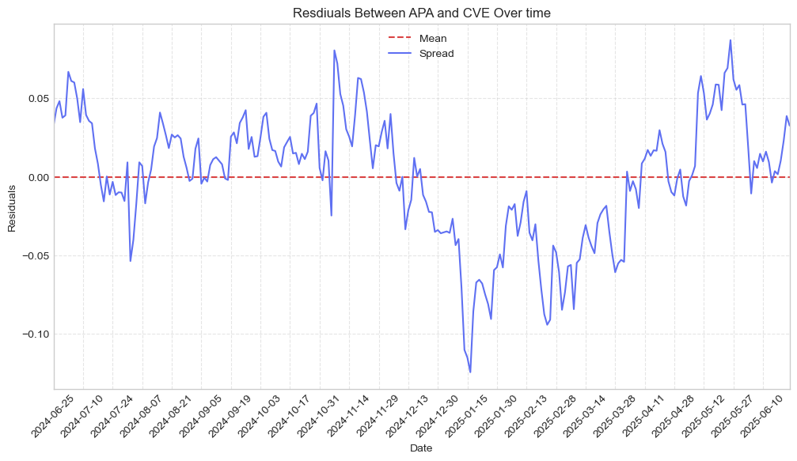

# Pairs Trading: Large-Scale Cointegration Testing Across Five Equity Sectors

*A student-led quantitative research project  
California State University, Fullerton — CIC | PCUBED Summer 2025*

---

## What is this?
> **For students** – an end‑to‑end lesson in scraping, time‑series stats, and strategy back‑testing.  

---

## 1 • Project Snapshot
We monitor **45 tickers in five sectors (225 tickers in total, up to 9,900 pair permutations)** for market‑neutral pairs‑trading edges.
* 45 stocks **1,980 unique pairs (ordered permutatinons)**
* For each pair we run the Engle-Granger regression in **both directions** since cointegration is asymmetric

| Tag | Sector | Example tickers |
|-----|--------|-----------------|
| **TECH**  | Technology & Semiconductors | NVDA AMD ADI |
| **PHARMA**| Pharmaceuticals / Biotech   | PFE LLY MRNA |
| **NRG**   | Energy (Oil & Gas, Services)| CVX XOM FANG |
| **INSUR** | Insurance & Financial Svcs  | ALL PGR TRV |
| **FASTF** | Fast‑Food Chains            | MCD YUM CMG |

**Pipeline**

1.  **Data Downloader** 1 trading year, daily prices (`yfinance`)  

2.  **Correlation Analysis** Pearson correlation coefficient, filter pairs with ρ ≥ 0.70 (C++)  

3.  **Cointegration Testing** via Engle‑Granger ADF test on log price residuals, p-value < 0.05 (Python) 

4.  **Back‑test** z‑score mean reversion (±1.5 in / ±0.5 out; 1 % loss stop)  

5.  **Visualize** residuals & heat‑maps in Jupyter

<p align="center">
  
  <br><em>Example: residual spread between APA & CVE (NRG sector)</em>
</p>

---

## 2 • Quick Start

> **📖 First time?** See [SETUP.md](SETUP.md) for detailed installation instructions.

```bash
# Quick setup (requires Python 3.8+, g++, pip)
git clone https://github.com/sicn4rf/pairs_trading_project.git
cd pairs_trading_project

# Create virtual environment and install dependencies
python3 -m venv venv
source venv/bin/activate  # Windows: venv\Scripts\activate
pip install -r requirements.txt

# Create required directories
mkdir -p data/{raw,processed/{successes,failures,misfits},results}

# Run pipeline
chmod +x run_all.sh  # Unix/Mac only
./run_all.sh

# Explore notebooks
jupyter lab src/visualization/
```

---

## 3 • Repository Layout
```text
.
├── config/              # sector lists, global params
│   └── ticker_macros.py
├── data/                # raw & processed CSVs (git‑ignored)
│   ├── raw/
│   └── processed/{results|successes|failures}
├── src/
│   ├── downloader/      # fetch_prices.py
│   ├── correlation/     # fast Pearson calc (C++)
│   ├── cointegration/   # engle_granger.py
│   ├── backtester/      # backtester.py + backtest_results.csv
│   └── visualization/   # heat_map.ipynb, residual_viewer.ipynb, …
├── utils/               # cli_ui.py, helpers
├── run_all.sh           # glue script
├── requirements.txt
└── README.md
```

---

## 4 • Configuration for Backtesting

| Key | Default | Description |
|-----|---------|-------------|
| `ROLL_Z`     | `21`  | rolling window for z‑score |
| `THRESH_IN`  | `1.5` | σ to open a trade |
| `THRESH_OUT` | `0.5` | σ to close (take profit) |
| `MAX_RISK`   | `0.01`| stop‑loss % of capital |
| `ADF_PVAL`   | `0.05`| cointegration p‑value cut‑off |

All live in **`src/backtester/backtester.py`**.

---

## 5 • Sample Results (NRG sector, 2024‑06‑25 → 2025‑06‑24)

| Pair | Trades | P&L USD | Ann.% | Sharpe |
|------|-------:|--------:|------:|-------:|
| `RIG_NOV` | **17** | **17 661** | **17.8 %** | **3.92** |
| `OII_RIG` | 15 | 15 383 | 15.5 % | 3.31 |
| `CVE_EOG` | 13 | 11 615 | 11.7 % | 2.62 |

Full table in **`src/backtester/backtest_results.csv`**.

---

## 6 • Limitations & Next Steps
* No transaction‑cost model — add realistic fees / slippage  
* Static hedge ratio — implement rolling β or Kalman filter  
* Single‑year sample — run multi‑year walk‑forward test  
* Look‑ahead bias — discover pairs in a rolling train/test window  

---

## 7 • Acknowledgements
Developed by **Francis Padua** & **Samuel Chun** under the mentorship of **Dr. Doina Bein**.  
Funded by **CSUF CIC | PCUBED** (Pathways, Pipeline, Practice).
